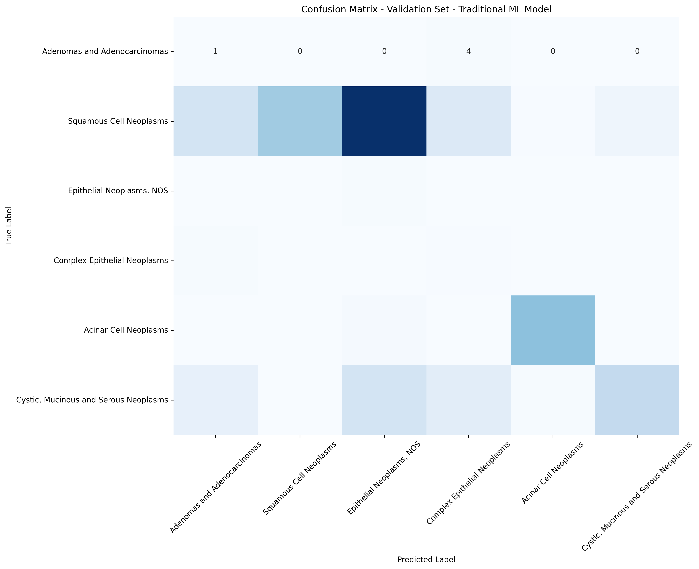
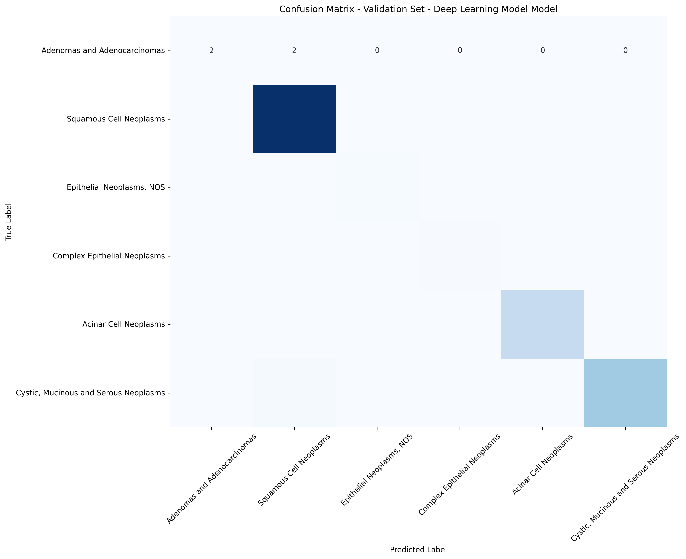

# TCGA Dataset Project

## Description of Scripts:

### Traditional ML Pipeline (random forest)

This dataset contains the following scripts to support the traditional ml pipeline:

feature_generation.py: 
    A function to extract a broad feature sets for a given account ID 
    by aggregating data from multiple datasets.
    
    A function to take ticket price levels as inputs and map it to a numerical value
    using a manually fixed projection of numeric values. 

random_forest_model_train.py:
    A function that performs K-Fold cross-validation with a Random Forest Classifier
    that produces a feature dataframe and a set of target variables. 
   
hyperparameter_optimization.py:
    A function utlizing the Optuna library to optimize a Random Forest Classifier model.

### Deep Learning Pipeline (Linear NN)

### Main Script

evaluation.py
    Main script that loads data, executes scripts, outputs prediction and generates submission.csv.
    PLEASE NOTE: .csv Datasets needs to be present in active directory. 

## Evaluation

    # Figure 1 Confusion Matrix - Validation Set - Traditional ML Model

    # Figure 2 Classification Report - Validation Set - Traditional ML Model

    # Figure 3 Classification Report - Test Set - Traditional ML Model

    # Figure 4 Classification Report - Test Set - Deep Learning Model

    # Figure 5 Classification Report - Validation Set - Deep Learning Model

    # Figure 6 Classification Report - Test Set - Deep Learning Model
